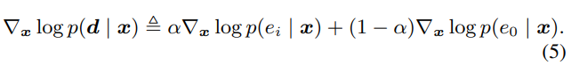

- [Experiment Result (GradTTS\_IIV + ESD)](#experiment-result-gradtts_iiv--esd)
  - [1. Audio conditioned on emotion and subemotion](#1-audio-conditioned-on-emotion-and-subemotion)
  - [2. Interp between different emotion](#2-interp-between-different-emotion)
  - [3. Iteration mel, audio](#3-iteration-mel-audio)
- [Result Anglyze](#result-anglyze)
  - [The Quality is not good](#the-quality-is-not-good)
    - [More time step?](#more-time-step)
  - [The emotion repr is not good](#the-emotion-repr-is-not-good)
    - [controlling by subemotion OR Intonation curve?](#controlling-by-subemotion-or-intonation-curve)
    - 
- [Benchmark](#benchmark)
  - [GradTTS](#gradtts)
  - [EmoDiff](#emodiff)
  - [Comparation benchmark models](#comparation-benchmark-models)
  - [Metric](#metric)
    - [1. Emotion Representative](#1-emotion-representative)
    - [2. Audio Quality](#2-audio-quality)

# Experiment Result (GradTTS_IIV + ESD)

## 1. Audio conditioned on emotion and subemotion
<table border="0">
 <tr>
    <td><b style="font-size:30px"></b></td>
    <td><b style="font-size:30px">SubEmo1</b></td>
    <td><b style="font-size:30px">SubEmo2</b></td>    
    <td><b style="font-size:30px">Interp12</b></td>
 </tr>
 <tr>
    <td>Happy</td>
    <td>
      <audio controls="controls">
      <source type="audio/mp3" src="out/sample_0_emo1.wav"></source>
      </audio>
    </td>
    <td>  
      <audio controls="controls">
      <source type="audio/mp3" src="out/sample_0_emo1.wav"></source>
      </audio>
    </td>
    <td>  
      <audio controls="controls">
      <source type="audio/mp3" src="out/sample_0_emo1.wav"></source>
      </audio>
    </td>
 </tr>
</table>

## 2. Interp between different emotion
<table border="0">
 <tr>
    <td><b style="font-size:30px"></b></td>
    <td><b style="font-size:30px">Sad</b></td>
    <td><b style="font-size:30px">Happy</b></td>    
    <td><b style="font-size:30px">Angry</b></td>
 </tr>
 <tr>
    <td>Sad</td>
    <td>
      <audio controls="controls">
      <source type="audio/mp3" src="out/sample_0_emo1.wav"></source>
      </audio>
    </td>
    <td>  
      <audio controls="controls">
      <source type="audio/mp3" src="out/sample_0_emo1.wav"></source>
      </audio>
    </td>
    <td>  
      <audio controls="controls">
      <source type="audio/mp3" src="out/sample_0_emo1.wav"></source>
      </audio>
    </td>
 </tr>
  <tr>
    <td>Happy</td>
    <td>
      <audio controls="controls">
      <source type="audio/mp3" src="out/sample_0_emo1.wav"></source>
      </audio>
    </td>
    <td>  
      <audio controls="controls">
      <source type="audio/mp3" src="out/sample_0_emo1.wav"></source>
      </audio>
    </td>
    <td>  
      <audio controls="controls">
      <source type="audio/mp3" src="out/sample_0_emo1.wav"></source>
      </audio>
    </td>
 </tr>
  <tr>
    <td>Angry</td>
    <td>
      <audio controls="controls">
      <source type="audio/mp3" src="out/sample_0_emo1.wav"></source>
      </audio>
    </td>
    <td>  
      <audio controls="controls">
      <source type="audio/mp3" src="out/sample_0_emo1.wav"></source>
      </audio>
    </td>
    <td>  
      <audio controls="controls">
      <source type="audio/mp3" src="out/sample_0_emo1.wav"></source>
      </audio>
    </td>
 </tr>
</table>

## 3. Iteration mel, audio

- The Intonation, and intensity should be changed in two stage respectively.
- 

<table border="0">
 <tr>
    <td><b style="font-size:30px">Iter_n</b></td>
    <td><b style="font-size:30px">Mel</b></td>
    <td><b style="font-size:30px">Vocoded Audio</b></td>    
 </tr>
 <tr>
    <td>Iter=0</td>
    <td>
    
    </td>
    <td>  
      <audDiversityio controls="controls">
      <source type="audio/mp3" src="out/sample_0_emo1.wav"></source>
      </audio>
    </td>
 </tr>
 <tr>
    <td><b style="font-size:30px"></b></td>
    <td><b style="font-size:30px">Mel</b></td>
    <td><b style="font-size:30px">Vocoded Audio</b></td>    
 </tr>
 <tr>
    <td>Iter=100</td>
    <td>
    
    </td>
    <td>  
      <audio controls="controls">
      <source type="audio/mp3" src="out/sample_0_emo1.wav"></source>
      </audio>
    </td>
 </tr> 
</table>

# Result Anglyze
## The Quality is not good
### More time step?

## The emotion repr is not good
### controlling by subemotion OR Intonation curve? 
### 

# Benchmark

## GradTTS
- Link: [gradTTS samples](https://grad-tts.github.io/)
- Conclude: 
  - N(0, I) get bettter emotion repr than N(u, I)
  - N(u, I) recude the number of reverse diffusion model for high quality
  - Comparation between N(0, I) and N(u, I) was below.
  - Time step of inferencing influence quality
<table border="0">
 <tr>
    <td><b style="font-size:30px"></b></td>
    <td><b style="font-size:30px">N(u, I)</b></td>
    <td><b style="font-size:30px">N(0, I)</b></td>
 </tr>
 <tr>
    <td>GradTTS_50 + Librispeech</td>
    <td>
      <audio controls="controls">
      <source type="audio/mp3" src="out/bechmark_speech/gradtts/grad_tts_m_10_1.wav"></source>
      </audio>
    </td>
    <td>  
      <audio controls="controls">
      <source type="audio/mp3" src="out/bechmark_speech/gradtts/grad_tts_0_10_1.wav"></source>
      </audio>
    </td>
</tr>
</table>

## EmoDiff
- Link: 
- Conclude: 
  - The emotion representatilve is well controlled.
  - The emotion intensity (well controlled)
    - Changing intensity by amplifying a specific word (pitch energy, duration?)
    - Intensity is implemented by **interpolating between neutural and specific emotion**.
    - The Gd intensity in evaluation is predicted by pre-trained model, not subjective result.
  - The diversity of emotion (well controlled)
    - Diversity contains different intonation which is controlled by reference audio or soft label?

<table border="0">
 <tr>
    <td><b style="font-size:30px"></b></td>
    <td><b style="font-size:30px">0</b></td>
    <td><b style="font-size:30px">0.5</b></td>
    <td><b style="font-size:30px">1</b></td>
 <tr>
    <td>Emodiff_ang</td>
    <td>
      <audio controls="controls">
      <source type="audio/mp3" src="out/bechmark_speech/gradtts_emodiff/[spk_4]-[emo_2]0011-Angry_000396.wav"></source>
      </audio>
    </td>
    <td>  
      <audio controls="controls">
      <source type="audio/mp3" src="out/bechmark_speech/gradtts_emodiff/[spk_4]-[emo_2(0.6)_0(0.4)]0011-Angry_000396.wav"></source>
      </audio>
    </td>
    <td>  
      <audio controls="controls">
      <source type="audio/mp3" src="out/bechmark_speech/gradtts_emodiff/[spk_4]-[emo_0]0011-Angry_000396.wav"></source>
      </audio>
    </td>
</tr>
 <tr>
     <td>Emodiff_happy</td>
    <td>
      <audio controls="controls">
      <source type="audio/mp3" src="out/bechmark_speech/gradtts_emodiff/[spk_4]-[emo_2]0011-Angry_000369.wav"></source>
      </audio>
    </td>
    <td>  
      <audio controls="controls">
      <source type="audio/mp3" src="out/bechmark_speech/gradtts_emodiff/[spk_4]-[emo_2(0.6)_1(0.4)]0011-Angry_000369.wav"></source>
      </audio>
    </td>
    <td>  
      <audio controls="controls">
      <source type="audio/mp3" src="out/bechmark_speech/gradtts_emodiff/[spk_4]-[emo_1]0011-Angry_000369.wav"></source>
      </audio>
    </td>
</tr>

</table>

## Comparation benchmark models
<table border="0">
 <tr>
    <td><b style="font-size:30px"></b></td>
    <td><b style="font-size:30px">Sad</b></td>
    <td><b style="font-size:30px">Happy</b></td>    
    <td><b style="font-size:30px">Angry</b></td>
 </tr>
 <tr>
    <td>MixedEmotion(Tactron) + ?</td>
    <td>
      <audio controls="controls">
      <source type="audio/mp3" src="out/bechmark_speech/mixedEmotion_tacotron/Mel_72_ref_Sad_TTS.wav"></source>
      </audio>
    </td>
    <td>  
      <audio controls="controls">
      <source type="audio/mp3" src="out/bechmark_speech/mixedEmotion_tacotron/Mel_94_ref_Happy_TTS.wav"></source>
      </audio>
    </td>
    <td>  
      <audio controls="controls">
      <source type="audio/mp3" src="out/bechmark_speech/mixedEmotion_tacotron/Mel_62_ref_Angry_TTS.wav"></source>
      </audio>
    </td>
 </tr>
    <td>GradTTS + Librispeech <- </td>
    <td>
      <audio controls="controls">
      <source type="audio/mp3" src="out/.wav"></source>
      </audio>
    </td>
    <td>  
      <audio controls="controls">
      <source type="audio/mp3" src="out/.wav"></source>
      </audio>
    </td>
    <td>  
      <audio controls="controls">
      <source type="audio/mp3" src="out/.wav"></source>
      </audio>
    </td>
 </tr>
  <tr>
    <td>GradTTS_EmoLabel + ESD*</td>
    <td>
      <audio controls="controls">
      <source type="audio/mp3" src="out/bechmark_speech/gradtts_emoLabel/0015-Sad_001072.wav"></source>
      </audio>
    </td>
    <td>  
      <audio controls="controls">
      <source type="audio/mp3" src="out/bechmark_speech/gradtts_emoLabel/0015-Happy_000794.wav"></source>
      </audio>
    </td>
    <td>  
      <audio controls="controls">
      <source type="audio/mp3" src="out/bechmark_speech/gradtts_emoLabel/0015-Angry_000362.wav"></source>
      </audio>
    </td>
 </tr>
  <tr>
    <td>EmoDiff + ESD</td>
    <td>
      <audio controls="controls">
      <source type="audio/mp3" src="out/bechmark_speech/gradtts_emodiff/0015-Sad_001072.wav"></source>
      </audio>
    </td>
    <td>  
      <audio controls="controls">
      <source type="audio/mp3" src="out/bechmark_speech/gradtts_emodiff/0015-Happy_000794.wav"></source>
      </audio>
    </td>
    <td>  
      <audio controls="controls">
      <source type="audio/mp3" src="out/bechmark_speech/gradtts_emodiff/0015-Angry_000362.wav"></source>
      </audio>
    </td>
 </tr>
</table>

## Metric
### 1. Emotion Representative
### 2. Audio Quality

<audio controls="controls">
  <source type="audio/mp3" src="out/sample_0_emo1.wav"></source>
</audio>

