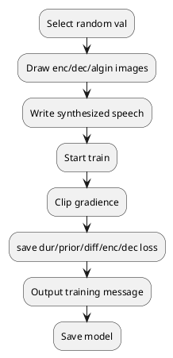

# Four mode in inference_cond.py
## 1. NO_INTERPOLATION

## 2. INTERPOLATE_INFERENCE_SIMP

## 3. INTERPOLATE_INFERENCE_TEMP

|    | frame2frame  | ? |
|---|---|---|
| speaker_id  | 19  |
| emo_label1  | angry  |
| emo_label2  | sad  |
| mask_range_tag  | all  |
| guidence_strength | 3.0 (0.0, 0.5, 1.0, 5.0)  |
| model | model_gradTTS_v2.yaml |
|**Conclusion**| 1. Changes of mels is too dramastically (below)    2. Syntheized speech still bad   3. ? |

- enc and dec mel-spectorgram changing

## 4. INTERPOLATE_INFERENCE_FREQ

# Activation in train_multi_speaker.py

# exp_main.py
## EVAL_TEMP_INTERP
### SER_EVAL
### PREF_EVAL
### TEMP_CASE_EVAL
## EVAL_FREQ_INTERP
## EVAL_NON_INTERP