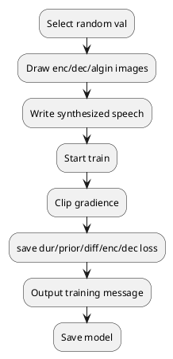

- [Train model](#train-model)
  - [train\_multi\_speaker.py](#train_multi_speakerpy)
- [Inference model](#inference-model)
  - [1. NO\_INTERPOLATION](#1-no_interpolation)
  - [2. INTERPOLATE\_INFERENCE\_SIMP](#2-interpolate_inference_simp)
  - [3. INTERPOLATE\_INFERENCE\_TEMP](#3-interpolate_inference_temp)
  - [4. INTERPOLATE\_INFERENCE\_FREQ](#4-interpolate_inference_freq)
- [Experiment result: log](#experiment-result-log)
- [Expriment code; exp](#expriment-code-exp)

# Train model
## train_multi_speaker.py

# Inference model
## 1. NO_INTERPOLATION

## 2. INTERPOLATE_INFERENCE_SIMP

## 3. INTERPOLATE_INFERENCE_TEMP

|    | frame2frame  | ? |
|---|---|---|
| speaker_id  | 19  |
| emo_label1  | angry  |
| emo_label2  | sad  |
| mask_range_tag  | all  |
| guidence_strength | 3.0 (0.0, 0.5, 1.0, 5.0)  |
| model | model_gradTTS_v2.yaml |
|**Conclusion**| 1. Changes of mels is too dramastically (below)    2. Syntheized speech still bad   3. ? |

- enc and dec mel-spectorgram changing

## 4. INTERPOLATE_INFERENCE_FREQ
# Experiment result: log
# Expriment code; exp

